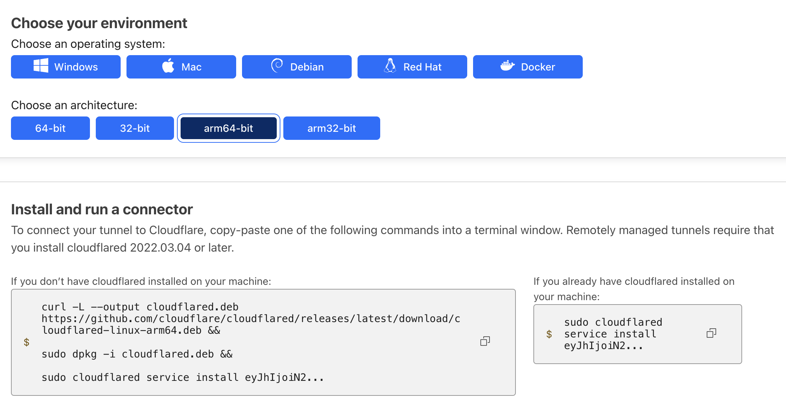

# Truy cập vào các Home Service từ bên ngoài thông qua domain

Đã chơi hệ smarthome DIY, thi thoảng bạn sẽ phải truy cập vào để debug/restart để xử lý các lỗi mà người dùng vô tình tạo ra. Đôi khi bạn không ở nhà hoặc khó có thể chạy tới truy cập mạng nội bộ để theo IP truy cập vào từng service. Vì vậy bạn sẽ cần thiết lập sẵn một phương án mở kết nối ra bên ngoài internet một cách an toàn và dễ dàng.

Cách truyền thống thông thướng sẽ yêu cầu bạn mở port và cấu hình kết nối tới local IP nhà bạn. Sử dụng script để update liên tục IP lên Cloudflare. Hoặc cấu hình VPN ở router để chui vào kết nối nội bộ. Tuy nhiên hiện tại có cách làm khác nhanh và hiệu quả hơn như sau.


Dịch vụ Zero Trust của CloudFlare


1. Truy cập CloudFlare Zero Trust vào phần Networks/Tunnels
2. Làm theo hướng dẫn để cài đặt một connector\
   


Bạn có thể sử dụng ChatGPT để chuyển đổi cấu trúc trên thành dạng Docker Compose để tiện kiểm soát


3. Truy cập Public Hostname khai báo local IP kèm theo port và có thể đặt tên miền tuỳ thích
4. Truy cập theo tên miền vừa đặt và tận hưởng thôi
